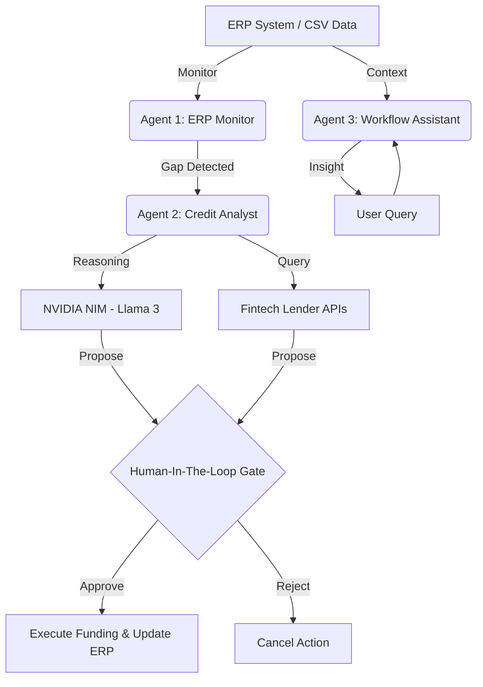

# Industrial JIT Financing Agent 🏭

[](https://www.python.org/downloads/)
[](https://streamlit.io/)
[](https://www.nvidia.com/en-us/ai-data-science/generative-ai/)
[](https://www.remotion.dev/)

**Just-In-Time (JIT) Financing for the Modern Supply Chain.**

**Slides:** [https://jungluchen.github.io/Industrial-JIT-Financing-Agent/](https://jungluchen.github.io/Industrial-JIT-Financing-Agent/)  
**Live Demo:** [https://industrial-jit-financing-agent.streamlit.app/](https://industrial-jit-financing-agent.streamlit.app/)

---

## 📖 Project Overview

### Problem Statement
In the fast-paced world of industrial manufacturing, Small and Medium Enterprises (SMEs) often face a critical **"Credit Lag."** When large Purchase Orders (POs) arrive, SMEs may have their capital locked in existing raw materials or inventory. Traditional bank financing is slow, often taking weeks for credit approval, which leads to missed production deadlines, broken supply chains, and lost revenue.

### The Solution
The **Industrial JIT Financing Agent** is an autonomous AI-driven orchestrator that monitors ERP systems in real-time. It detects immediate funding gaps and uses high-speed reasoning via **NVIDIA NIM** to assess credit risk and propose financing solutions instantly. By bridging the gap between "Just-In-Time" production and "Just-In-Time" financing, this agent ensures that capital flows as fast as the production line.

---

## 💼 Business Analysis

### Market Need
The global supply chain finance market is growing, but remains fragmented and slow for SMEs. There is a massive need for automated, data-driven credit decisions that can respond within minutes, not weeks.

### Target Users
- **Manufacturing SMEs**: Companies requiring instant working capital to fulfill large orders.
- **Supply Chain Managers**: Professionals looking to eliminate bottlenecks caused by financial friction.
- **Fintech Lenders**: Institutions seeking automated risk assessment and high-quality lead generation.

### Competitive Advantage
- **Real-time Monitoring**: Direct integration with ERP data for proactive gap detection.
- **Agentic Reasoning**: Uses Llama-3 (via NVIDIA NIM) to perform complex credit risk analysis beyond simple heuristics.
- **Human-In-The-Loop (HITL)**: Combines AI efficiency with human oversight for 100% financial security.
- **JIT Execution**: Instant querying of multiple lender APIs to find the best market rates.

### Revenue Model
- **SaaS Subscription**: Tiered pricing for industrial monitoring.
- **Transaction Fees**: Small percentage fee on every funded PO.
- **Lead Generation**: Referral fees from fintech lenders integrated into the platform.

---

## 🏗️ Technical Architecture

### System Workflow
The project follows a multi-agent orchestration pattern:

1.  **Agent 1 (ERP Monitor)**: Continuously scans Purchase Order data for shortfalls where `Amount > Available_Balance`.
2.  **Agent 2 (Credit Analyst)**: Triggered by a gap detection. It calls the **NVIDIA NIM API** to analyze supplier reliability, order criticality, and overall risk.
3.  **Lender API Tool**: Agent 2 queries a mock fintech API to fetch real-time interest rates and terms.
4.  **HITL Gate**: Presents the reasoning and financing options to a human manager for final approval.
5.  **Agent 3 (Workflow Assistant)**: An interactive chat agent that provides deep insights into ERP data and financial risks upon request.

### Data Flow Diagram


---

## 🛠️ Tech Stack & Dependencies

- **Frontend**: [Streamlit](https://streamlit.io/) for the interactive dashboard.
- **AI Engine**: [NVIDIA NIM](https://build.nvidia.com/) (Llama-3-8b-instruct) for reasoning and chat.
- **Data Analysis**: [Pandas](https://pandas.pydata.org/) for ERP data manipulation.
- **Video Production**: [Remotion](https://www.remotion.dev/) for the automated tutorial generation.
- **Language**: Python 3.9+ and TypeScript (for Remotion).

---

## 🚀 Installation & Setup

### Prerequisites
- Python 3.9 or higher.
- Node.js (for the video tutorial component).
- An NVIDIA NIM API Key.

### 1. Clone the Repository
```bash
git clone https://github.com/your-repo/industrial_credit_agent.git
cd industrial_credit_agent
```

### 2. Python Environment Setup
```bash
# Create and activate virtual environment
python -m venv venv
source venv/bin/activate  # On Windows: venv\Scripts\activate

# Install dependencies
pip install -r requirements.txt
```

### 3. Configuration
Create a `.streamlit/secrets.toml` file and add your NVIDIA API key:
```toml
NVIDIA_API_KEY = "your_nvidia_api_key_here"
```

### 4. Run the Application
```bash
streamlit run app.py
```

### 5. Video Tutorial Setup (Optional)
To preview or render the project video:
```bash
cd video_tutorial
npm install
npm run dev # To preview
npm run build # To render
```

---

## 📡 API Documentation

### NVIDIA NIM Integration
The agent uses the OpenAI-compatible NVIDIA NIM endpoint for reasoning:

```python
from openai import OpenAI

client = OpenAI(
    base_url="https://integrate.api.nvidia.com/v1",
    api_key=os.getenv("NVIDIA_API_KEY")
)

def get_reasoning(order_data):
    response = client.chat.completions.create(
        model="meta/llama3-8b-instruct",
        messages=[
            {"role": "system", "content": "You are a senior financial analyst."},
            {"role": "user", "content": f"Analyze this PO: {order_data}"}
        ]
    )
    return response.choices[0].message.content
```

### Mock Lender API
The system simulates an external API call to fetch rates:
- **Endpoint**: `query_lender_api(funding_amount)`
- **Response**: List of objects containing `Lender`, `Rate`, `Term`, and `Approval` status.

---

## 📈 Performance Benchmarks

| Metric | Target Performance | Description |
| :--- | :--- | :--- |
| **Gap Detection** | < 100ms | Time to scan 1,000+ ERP records. |
| **Reasoning Latency** | 1.5s - 2.5s | Response time from NVIDIA NIM (Llama-3). |
| **Tool Execution** | < 1.0s | Simulated latency for external lender API queries. |
| **System Uptime** | 99.9% | Cloud-native deployment target. |

---

## ✨ Innovation & Domain Impact
This project introduces **Agentic Fintech** to the industrial sector. By moving away from static dashboards and towards autonomous agents that can *reason* and *act*, we eliminate the "Information Silo" between ERP data and financial services. The inclusion of a **Human-In-The-Loop** security gate addresses the primary concern of AI adoption in finance: trust and accountability.

---

## 🤝 Contribution Guidelines
We welcome contributions!
1.  Fork the Project.
2.  Create your Feature Branch (`git checkout -b feature/AmazingFeature`).
3.  Commit your Changes (`git commit -m 'Add some AmazingFeature'`).
4.  Push to the Branch (`git push origin feature/AmazingFeature`).
5.  Open a Pull Request.

---

## 📄 License
Distributed under the MIT License. See `LICENSE` for more information.

---

**Developed for Course:** DBA5105 Fintech, Enabling Technologies and Analytics  
**Author:** Chen Jung-Lu  
**University:** National University of Singapore (NUS)
